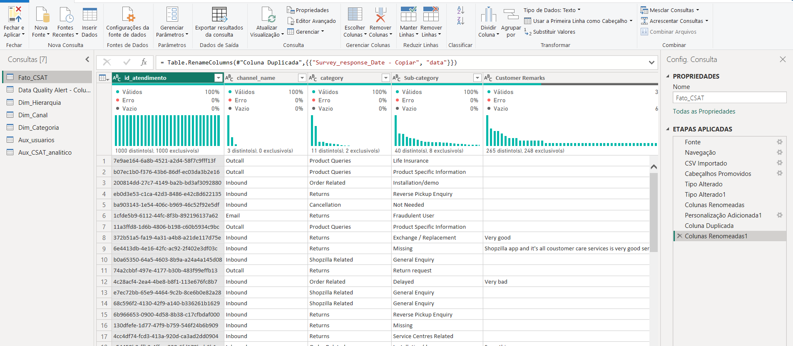
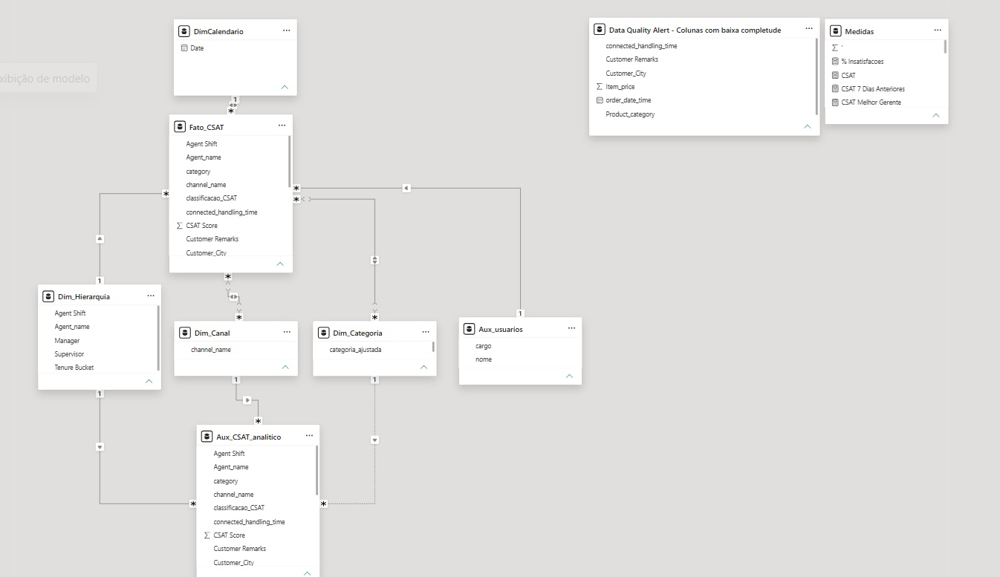
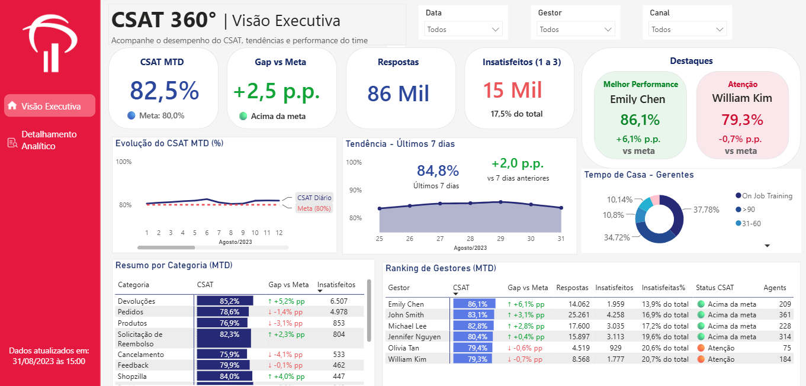
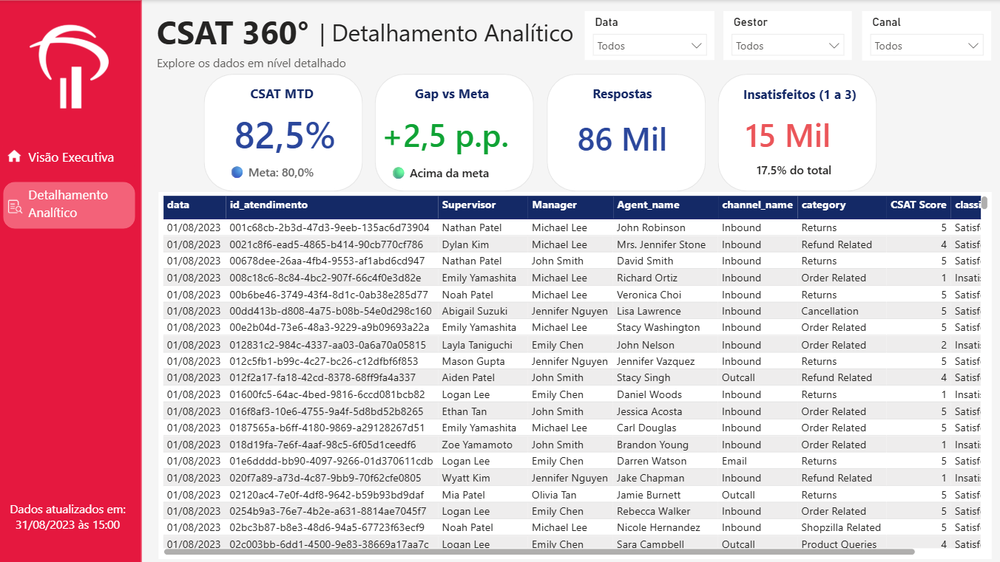

# 📊 CSAT 360° — Dashboard Executivo | Power BI

## Sobre o projeto

Desenvolvimento de um **Dashboard Executivo de Customer Satisfaction (CSAT)** em Power BI, criado para atender a um case de negócio.

O objetivo foi consolidar o desempenho do CSAT, acompanhar a meta de **80%**, identificar pontos de atenção e gerar análises que apoiassem a tomada de decisão.

O projeto foi desenvolvido como parte de um case técnico para processo seletivo na área de Dados/Business Intelligence, contemplando preparação e modelagem dos dados, criação de indicadores em DAX, visualização executiva, análise consultiva e controle de acesso por **Row-Level Security (RLS)**.

---

## 🔄 1. Tratamento dos dados — Power Query

A base `Customer_support_data.csv` foi conectada ao Power BI e preparada utilizando o **Power Query**, realizando os tratamentos necessários para disponibilizar os dados para análise.



---

## 🧩 2. Modelagem de dados

Foi desenvolvido um **modelo dimensional em esquema estrela**, organizando as tabelas e seus relacionamentos para facilitar a criação das medidas, aplicação de filtros e análise dos indicadores.



---

## 📐 3. Medidas e indicadores — DAX

Foram desenvolvidas diversas **medidas DAX** para construir os indicadores e análises apresentados no dashboard.

Entre os principais indicadores estão:

* CSAT
* Meta de CSAT
* Gap vs. Meta
* Quantidade de respostas
* Quantidade e percentual de insatisfeitos
* Evolução do CSAT
* Tendência dos últimos 7 dias
* Desempenho por categoria
* Ranking de gestores

### Exemplo de medida

```DAX
Melhor Gerente = 
VAR TabelaGerentes =
    ADDCOLUMNS(
        ALLSELECTED(Fato_CSAT[Manager]),
        "@Performance", [CSAT]
    )
VAR Melhor =
    TOPN(
        1,
        TabelaGerentes,
        [@Performance], DESC
    )
RETURN
    CONCATENATEX(
        Melhor,
        Fato_CSAT[Manager],
        ", "
    )
```

---

## 📊 4. Dashboard Executivo

O painel foi desenvolvido com foco em **objetividade, acompanhamento da meta e identificação dos principais pontos de atenção**.



### Principais resultados

| Indicador                   |      Resultado |
| --------------------------- | -------------: |
| **CSAT MTD**                |          82,5% |
| **Meta**                    |          80,0% |
| **Gap vs. Meta**            |      +2,5 p.p. |
| **Respostas**               |         86 mil |
| **Insatisfeitos**           | 15 mil (17,5%) |
| **CSAT últimos 7 dias**     |          84,8% |
| **Evolução últimos 7 dias** |      +2,0 p.p. |

O resultado acumulado está **2,5 p.p. acima da meta**, indicando desempenho geral positivo.

A tendência recente também é favorável, com **CSAT de 84,8% nos últimos 7 dias** e evolução de **2,0 p.p.** em relação ao período anterior.

---

## 🔐 5. Controle de acesso — RLS

Foi implementado **Row-Level Security (RLS)** para atender ao requisito de controle de acesso do case.

O painel deve ser disponibilizado exclusivamente para **gerentes**, enquanto **John Smith** possui acesso diferenciado aos dados analíticos para visualização e extração em Excel.



---

## 📈 Análise final

### O CSAT está acima da meta?

**Sim.**

O CSAT acumulado está em **82,5%**, ficando **2,5 p.p. acima da meta de 80%**.

Além disso, o resultado dos últimos 7 dias foi de **84,8%**, indicando uma evolução recente positiva.

### Estamos evoluindo ou deteriorando?

A tendência recente é de **evolução**, com aumento de **2,0 p.p. no CSAT** em relação aos 7 dias anteriores.

Apesar do resultado positivo, o acompanhamento contínuo é importante para identificar possíveis oscilações e evitar deterioração futura.

### Onde estão os principais pontos de atenção?

Entre as categorias apresentadas no dashboard, os menores CSATs estão em:

| Categoria        |  CSAT | Gap vs. Meta |
| ---------------- | ----: | -----------: |
| **Cancelamento** | 75,9% |    -4,1 p.p. |
| **Produtos**     | 76,9% |    -3,1 p.p. |
| **Pedidos**      | 78,6% |    -1,4 p.p. |
| **Feedback**     | 79,9% |    -0,1 p.p. |

Além do percentual de CSAT, o **volume de clientes insatisfeitos** deve ser considerado para priorizar ações.

Por exemplo, **Pedidos** concentra **4.978 avaliações insatisfeitas**, enquanto **Devoluções**, apesar do CSAT de **85,2%**, apresenta **6.507 insatisfeitos** devido ao maior volume de avaliações.

### Sugestões de melhoria

A partir dos resultados, recomenda-se:

* Priorizar a análise das categorias **Cancelamento** e **Produtos**, que apresentam os maiores gaps em relação à meta.
* Investigar as causas das avaliações negativas em **Pedidos**, considerando o volume relevante de insatisfeitos.
* Avaliar **Devoluções** pelo volume absoluto de insatisfeitos, mesmo apresentando CSAT acima da meta.
* Acompanhar o CSAT por **categoria, gestor e período**, permitindo identificar rapidamente mudanças de comportamento.
* Criar planos de ação específicos para as categorias abaixo da meta e acompanhar a evolução dos resultados após as intervenções.

---

## 🛠️ Ferramentas utilizadas

* **Power BI**
* **Power Query**
* **DAX**
* **Excel**
* **Row-Level Security (RLS)**

---

## 🎯 Conclusão

O dashboard permite uma visão executiva do desempenho do CSAT, combinando **indicadores, evolução temporal, análise por categoria, volume de insatisfeitos e controle de acesso**.

A análise demonstra que o resultado geral está acima da meta, mas existem oportunidades de melhoria principalmente nas categorias com menor CSAT e naquelas que concentram maior volume de clientes insatisfeitos.
